---

<p align="center">
  
</p>

<h1 align="center">Human Verification System </h1>

<p align="center">
  <b>Modular, Client-Side Human Verification | AI & JS Powered | GitHub Pages Ready</b><br>
  
</p>
<br>

---

## 📌 Table of Contents

* [Project Overview](#project-overview-🚀)
* [Features](#features-✨)
* [File Structure](#file-structure-📂)
* [Installation & Deployment](#installation--deployment-🛠️)
* [Usage](#usage-🚀)
* [dd.html Redirect Info](#ddhtml-redirect-info-🔗)
* [Workflow](#workflow-📈)
* [Technologies & Badges](#technologies--badges-💻)
* [Acknowledgements](#acknowledgements-🙏)
* [Contact & Socials](#contact--socials-🌐)

---

## Project Overview 🚀

A **modular, client-side human verification system** featuring multiple challenge modules (text, math, slider, moving dot), session management (6-hour token), and secure redirection. Fully static, professional, and deployable on GitHub Pages.

---

## Features ✨

* **Multiple Verification Modules:**

  * Text CAPTCHA, Arithmetic, Moving Dot, Slider
* **Session Management:**

  * LocalStorage-based token with 6-hour expiration
* **Secure Redirects:**

  * `dd.html` detects session validity, invalid access triggers 7-second fallback
* **Professional UI:**

  * Modern, responsive design, mobile + desktop compatible
* **Fully Static Deployment:**

  * Can run directly from GitHub Pages or any static host
* **Easy Extensibility:**

  * Add new modules or update redirect URL by modifying a single JS variable

---

## File Structure 📂

```
index.html          # Main entry page; challenge container
style.css           # Styling for pages & modules
utils.js            # Session/token management & helper functions
main.js             # Loads challenges, controls verification workflow
text.js             # Canvas-based text CAPTCHA
math.js             # Arithmetic challenge
dot.js              # Moving dot click challenge
slider.js           # Slider verification (desktop + mobile)
dd.html             # Redirect page; session detection & fallback
README.md           # This documentation
```

---

## Installation & Deployment 🛠️

1. Clone the repository:

```bash
git clone https://github.com/yourusername/human-verification-system.git
```

2. Navigate into the project folder:

```bash
cd human-verification-system
```

3. Open `index.html` in browser to test locally, or deploy on GitHub Pages.

---

## Usage 🚀

1. Open `index.html`.
2. Complete any challenge module.
3. Verified session is stored in localStorage (6 hours).
4. User is redirected to `dd.html`.

   * If session valid → direct redirect to target URL.
   * If invalid → 7-second countdown → back to verification page.

---

## dd.html Redirect Info 🔗

* **Redirect URL variable:**

```javascript
const REDIRECT_TARGET = "https://docs.google.com/forms/d/e/1FAIpQLSdqcVijtxP2qtiwFtuS-NFBL9_Pnbf6WwiydLnzh4nbxQWy1Q/viewform";
```

* **Location:** Top of the `<script>` section in `dd.html`, **before session check logic**.
* **Session Detection & Redirect:**

```javascript
if (localStorage.getItem("verifiedToken")) {
    // Session valid → direct redirect
    window.location.href = REDIRECT_TARGET;
} else {
    // Session invalid → show error + 7s countdown
    setTimeout(() => {
        window.location.href = "index.html"; // Back to verification
    }, 7000);
}
```

* **Purpose:** Prevents bots or direct access to `dd.html` without verification.

---

## Workflow 📈

```mermaid
flowchart LR
    A[User opens index.html] --> B{Challenge Module}
    B -->|Text CAPTCHA| C[Verify Success → Store Session]
    B -->|Math Challenge| C
    B -->|Moving Dot| C
    B -->|Slider| C
    C --> D[Redirect to dd.html]
    D -->|Session Valid| E[Redirect to Target Form]
    D -->|Session Invalid| F[7s Countdown → Back to index.html]
```



---

## Technologies & Badges 💻

**Frontend:**


**Tools & Utilities:**


---

## Acknowledgements 🙏

* Inspired by modern GitHub profile README designs
* Open-source libraries & JS canvas practices
* AI-powered project structure & modular design approach

---

## Contact & Socials 🌐

<p align="center">
  <a href="https://www.deepdeyiitk.com"></a>
  <a href="mailto:thedeeparise@gmail.com"></a>
  <a href="https://www.instagram.com/deepdey.official/"></a>
  <a href="https://www.youtube.com/@deepdeyiit"></a>
  <a href="https://x.com/deepdeyofficial"></a>
</p>

---

<p align="center">
  <em>Designed & Developed with ❤️ by <b>Deep Dey</b> — Professional, Modular, AI-assisted Frontend Verification System</em>
</p>

---
