---

<p align="center">
  
</p>

<h1 align="center">🌟 Human Verification System </h1>

<p align="center">
  <b>Modular, Client-Side Human Verification | AI & JS Powered | GitHub Pages Ready</b><br>
  
</p>

<p align="center">
  
</p>

---

## 📌 Table of Contents

* [Project Overview](#project-overview-🚀)
* [Features](#features-✨)
* [File Structure](#file-structure-📂)
* [Installation & Deployment](#installation--deployment-🛠️)
* [Usage](#usage-🚀)
* [dd.html Redirect Info](#ddhtml-redirect-info-🔗)
* [Workflow](#workflow-📈)
* [Technologies & Badges](#technologies--badges-💻)
* [Acknowledgements](#acknowledgements-🙏)
* [Contact & Socials](#contact--socials-🌐)

---

## Project Overview 🚀

A **modular, client-side human verification system** featuring multiple challenge modules (text, math, slider, moving dot), session management (6-hour token), and secure redirection. Fully static, professional, and deployable on GitHub Pages.

💡 Designed for **maximum user engagement** with modern UI, animations, and interactive challenges.

---

## Features ✨

* **Multiple Verification Modules:**

  * Text CAPTCHA 📝, Arithmetic ➕, Moving Dot 🎯, Slider ⬅️➡️
* **Session Management:**

  * LocalStorage-based token valid for **6 hours**
* **Secure Redirects:**

  * `dd.html` validates session → valid → redirect
  * Invalid → 7s countdown → back to verification page
* **Modern UI & Animations:**

  * Confetti 🎉, smooth transitions, interactive feedback
* **Static Deployment:**

  * GitHub Pages or any static host ready
* **Extensible:**

  * Easy to add new challenges or update redirect URL

 * **Live Demo:**
 * Want to check live demo: [support.deepdeyiitk.com](https://support.deepdeyiitk.com/)

---

## File Structure 📂

```
index.html          # Main entry page; challenge container
style.css           # Modern styling & animations
utils.js            # Session/token management & helper functions
main.js             # Challenge loader & verification workflow
text.js             # Canvas-based text CAPTCHA
math.js             # Arithmetic challenge
dot.js              # Moving dot challenge
slider.js           # Slider verification (desktop + mobile)
puzzle.js           # Human-friendly drag piece verification, bot-resistant system.
dd.html             # Redirect page; session detection + fallback
README.md           # Project documentation (this file)
SECURITY.md         # Guidelines: domain restriction, bot prevention, usage rules
LICENSE.md          # Modified MIT-style license with credit & domain rules
```

---

## Installation & Deployment 🛠️

1. Clone the repo:

```bash
git clone https://github.com/deepdeyiitgn/support-page-deepdeyiitk.com.git
```

2. Open `index.html` to test locally or deploy to **GitHub Pages**.

3. Optional: Customize challenges and redirect URL in `dd.html`.

---

## Usage 🚀

1. Open `index.html`.
2. Complete any challenge module.
3. Session stored in localStorage (6h).
4. Redirect via `dd.html`:

   * ✅ Session valid → go to target URL
   * ❌ Invalid → 7s countdown → back to verification

---

## dd.html Redirect Info 🔗

* **Redirect URL variable (top of `<script>`):**

```javascript
const REDIRECT_TARGET = "https://docs.google.com/forms/d/e/1FAIpQLSdqcVijtxP2qtiwFtuS-NFBL9_Pnbf6WwiydLnzh4nbxQWy1Q/viewform";
```

* **Session Detection Logic:**

```javascript
if (localStorage.getItem("verifiedToken")) {
    // ✅ valid → redirect
    window.location.href = REDIRECT_TARGET;
} else {
    // ❌ invalid → show error + 7s timer
    setTimeout(() => {
        window.location.href = "index.html";
    }, 7000);
}
```

---

## Workflow 📈

```mermaid
flowchart LR
    A[User opens index.html] --> B{Challenge Module}
    B -->|Text CAPTCHA| C[Store Session Token]
    B -->|Math Challenge| C
    B -->|Moving Dot| C
    B -->|Slider| C
    C --> D[Redirect to dd.html]
    D -->|Session Valid| E[Redirect to Target URL]
    D -->|Session Invalid| F[7s Timer → Back to index.html]
```



---

## Technologies & Badges 💻

**Frontend & UI:**


**Tools & Utilities:**


---

## Acknowledgements 🙏

* GitHub profile README designs inspiration
* JS & Canvas open-source practices
* AI-assisted modular project design

---

## Contact & Socials 🌐

<p align="center">
  <a href="https://www.deepdeyiitk.com"></a>
  <a href="mailto:thedeeparise@gmail.com"></a>
  <a href="https://www.instagram.com/deepdey.official/"></a>
  <a href="https://www.youtube.com/@deepdeyiit"></a>
  <a href="https://x.com/deepdeyofficial"></a>
</p>

---

<p align="center">
  <em>Designed & Developed with ❤️ by <b>Deep Dey</b> — Professional, Modular, AI-assisted Frontend Verification System</em>
</p>

<p align="center">
  
</p>

---
